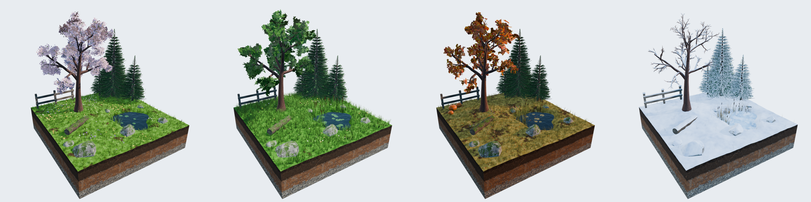
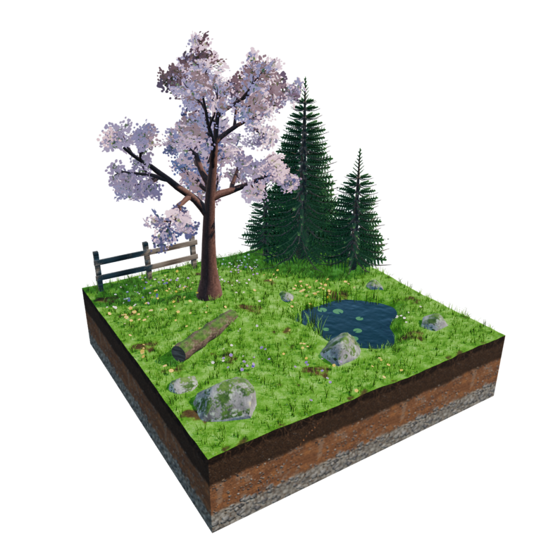
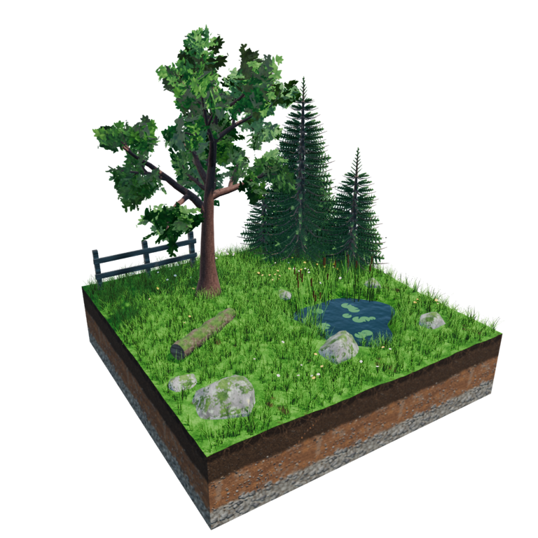
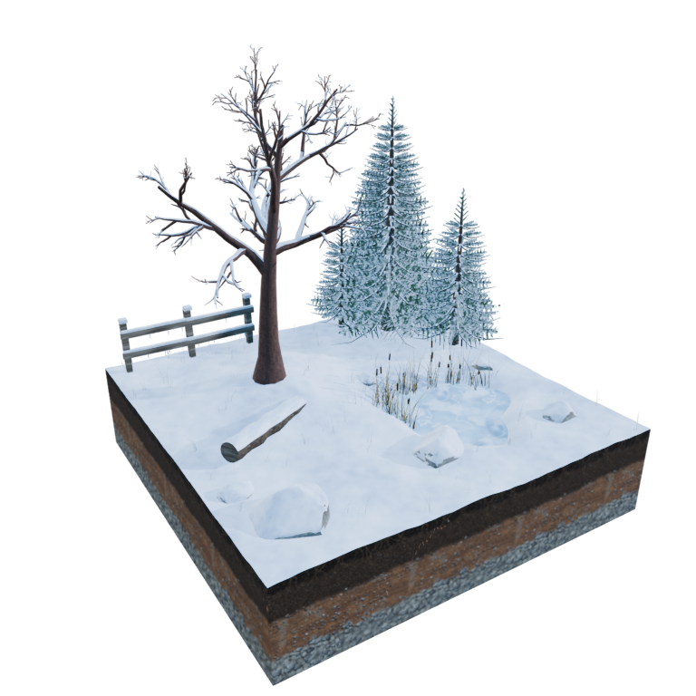
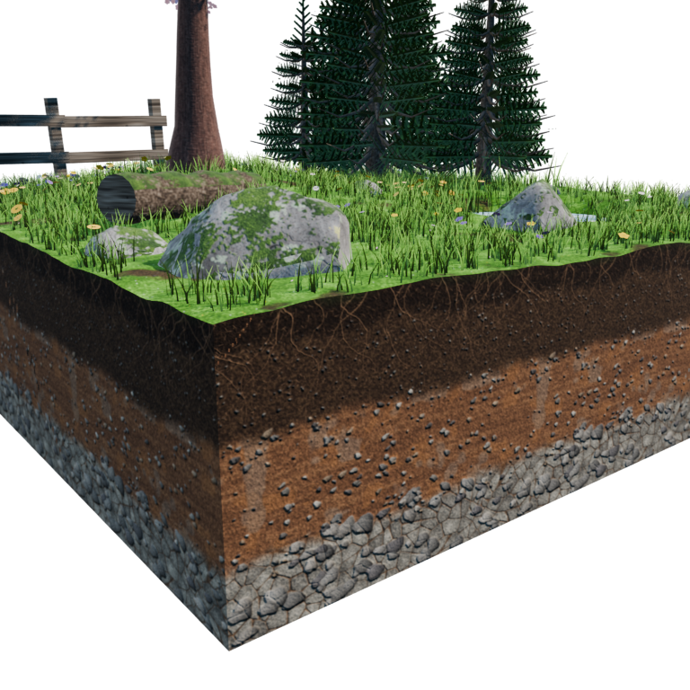
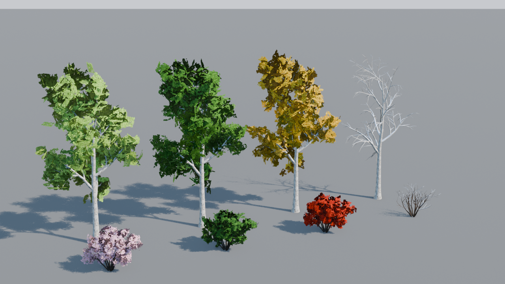

# 사계절 에셋 — Unity 프로젝트

Blender로 만든 사실적인 사계절 디오라마 타일 4개와 소품 팩을 Unity 프로젝트로 옮긴 것.
열면 데모 씬이 자동으로 만들어지고, 키 하나로 계절을 바꿔 볼 수 있다.



## 열기

1. **Unity Hub → Add → Add project from disk → 이 `UnityProject` 폴더** 선택.
   - 기준 버전은 Unity 6 (`6000.0.23f1`). 다른 Unity 6 / 2022.3 LTS로 열어도 된다
     (Hub가 버전을 물으면 설치된 버전을 고르면 됨).
2. 처음 열 때 Package Manager가 **glTFast**(`com.unity.cloud.gltfast`, Unity 공식 glTF 임포터)를
   자동으로 설치하고 `.glb` 두 개를 임포트한다.
3. 임포트가 끝나면 `Assets/Seasons/Scenes/Seasons.unity`가 **자동으로 생성되어 열린다.**
   안 열리면 메뉴 **Seasons → Build Demo Scene**.
4. ▶ Play.

> 처음 열 때 "새 Input System 백엔드를 켤까요?(Restart)" 창이 뜨면 **Yes**를 눌러도, **No**를 눌러도 된다
> (스크립트가 두 입력 방식을 모두 지원함).
>
> glTFast 버전(`Packages/manifest.json`의 `6.8.0`)을 찾지 못한다는 오류가 나면
> Package Manager → **+ → Add package by name → `com.unity.cloud.gltfast`** 로 최신 버전을 설치하면 된다.

## 터미널로 게임 만들어서 실행하기

Unity 창을 다 닫고 실행한다. 처음 한 번은 패키지 설치·임포트·빌드 때문에 몇 분 걸린다.

**Windows (PowerShell)**
```powershell
cd C:\
git clone -b claude/magical-wozniak-9vhj7z https://github.com/foeplob11-code/-.git seasons   # 이미 받았으면: cd C:\seasons; git pull
$unity = (Get-ChildItem "C:\Program Files\Unity\Hub\Editor" | Sort-Object Name | Select-Object -Last 1).FullName + "\Editor\Unity.exe"
Start-Process -Wait -FilePath $unity -ArgumentList "-batchmode","-quit","-projectPath","C:\seasons\UnityProject","-executeMethod","RealisticSeasons.EditorTools.SeasonsBuild.Build","-logFile","C:\seasons\build.log"
& "C:\seasons\UnityProject\Builds\Windows\Seasons.exe"
```

**Mac (터미널)**
```bash
cd ~/Desktop && git clone -b claude/magical-wozniak-9vhj7z https://github.com/foeplob11-code/-.git seasons   # 이미 받았으면: cd ~/Desktop/seasons && git pull
cd ~/Desktop/seasons
APP="$(ls -d /Applications/Unity/Hub/Editor/*/Unity.app | tail -1)"
"$APP/Contents/MacOS/Unity" -batchmode -quit -projectPath "$PWD/UnityProject" -executeMethod RealisticSeasons.EditorTools.SeasonsBuild.Build -logFile "$PWD/build.log"
open UnityProject/Builds/Mac/Seasons.app
```

게임 파일이 안 생기면 `build.log`에서 `error`가 들어간 줄을 찾으면 원인이 나온다.
에디터 안에서는 메뉴 **Seasons → Build Game**으로 같은 빌드를 만들 수 있다.

## 조작 (Play 모드)

| 키 / 마우스 | 동작 |
|---|---|
| `1` `2` `3` `4` | 봄 / 여름 / 가을 / 겨울 타일만 보기 (계절별 태양·하늘·안개로 바뀜) |
| `0` | 네 계절 나란히 보기 |
| `P` | 소품 팩 보기 |
| `Z` / `X` | 바람 약하게 / 세게 |
| 우클릭(또는 좌클릭) 드래그 | 회전 |
| 휠클릭 드래그 / Shift + 드래그 | 이동 |
| 휠 | 줌 |
| `WASD` / 방향키 | 시점 이동 |
| `H` | 도움말 숨기기 |
| `Esc` | 게임 종료 (빌드한 게임에서) |

## 들어 있는 것

| 경로 | 내용 |
|---|---|
| `Assets/Seasons/Models/realistic_seasons.glb` | 7 m × 7 m 타일 4개 (`Spring_Tile` … `Winter_Tile`), 약 31만 폴리곤, 텍스처 포함 |
| `Assets/Seasons/Models/realistic_props.glb` | 소품 22종 (`Prop_*`), 약 6만 폴리곤, 가로등 점광원 포함 |
| `Assets/Seasons/Scripts/SeasonSwitcher.cs` | 계절 전환 + 계절별 조명 프리셋(인스펙터에서 수정 가능) |
| `Assets/Seasons/Scripts/SeasonsWind.cs` | 바람: 나무·풀·꽃 재질을 바람 셰이더로 바꾸고 방향·세기·돌풍을 매 프레임 전달 |
| `Assets/Seasons/Shaders/WindFoliage.shader` | 바람에 흔들리는 PBR 셰이더 (Built-in 렌더 파이프라인) |
| `Assets/Seasons/Scripts/OrbitCamera.cs` | 회전·이동·줌 카메라 |
| `Assets/Seasons/Scripts/InputCompat.cs` | 구 Input Manager / 새 Input System 둘 다 지원 |
| `Assets/Seasons/Editor/SeasonsSceneBuilder.cs` | 데모 씬 생성기 (메뉴 `Seasons`) |
| `Assets/Seasons/Editor/SeasonsBuild.cs` | 게임 빌드 (메뉴 `Seasons → Build Game` 또는 터미널) |
| `Blender/` | 에셋 생성 스크립트 (Unity는 이 폴더를 무시함) |
| `Docs/` | Blender 렌더 이미지 |

씬 생성기는 GLB에 같이 들어 있는 Blender 카메라와 태양은 꺼 두고, Unity용 태양(Directional Light,
소프트 섀도)과 카메라를 새로 만든다. 프로젝트 색 공간은 Linear로, 그림자 거리는 최소 90 m로 늘린다.

## 바람

Play를 누르면 나무와 풀이 바람에 흔들린다. 셰이더가 버텍스를 움직이는 방식이라 애니메이션 데이터는 없다.

- **나무**(벚나무·가문비·자작나무·관목): 밑동은 고정되고 위로 갈수록 크게 휜다. 가지와 잎이 같은 식으로 휘어서
  잎이 가지에서 떨어져 보이지 않는다. 겨울 가지 위의 눈도 함께 움직인다.
- **잎**: 휘는 것에 더해 잎 카드마다 파르르 떨린다(자작나무·벚나무가 가장 많이, 가문비 솔잎은 조금).
- **풀·갈대**: 뿌리는 고정, 끝만 휜다. 언덕 위에 난 풀도 뿌리가 움직이지 않는다(블레이드 UV 기준).
- **꽃·부들**: 줄기가 밑에서 꺾이고 꽃송이가 줄기 끝을 따라간다.
- 바람은 장면을 가로지르는 파도처럼 지나가고, 돌풍이 불었다 잦아들며 방향도 천천히 바뀐다.
- 계절마다 세기가 다르다: 가을 1.3배, 봄 0.9배, 겨울 0.8배, 여름 0.7배.
- `Season Switcher` 오브젝트의 **SeasonsWind**에서 세기·방향·속도·돌풍 정도·계절별 배율을 조절할 수 있다.
- 땅에 떨어진 낙엽·꽃잎, 바위, 건물은 움직이지 않는다.

## 타일

| 봄 Spring | 여름 Summer | 가을 Autumn | 겨울 Winter |
|---|---|---|---|
|  |  |  |  |
| 벚꽃 만개, 들꽃, 떨어진 꽃잎 | 짙은 잎, 키 큰 풀, 부들, 연잎 | 단풍, 마른 풀, 낙엽, 버섯, 호박 | 눈 덮인 가지·가문비·바위, 얼어붙은 연못, 고드름 |

- 흙 단면은 유기층 → 표토 → 점토층 → 풍화암층, 바위는 쪼개진 면이 있는 화강암(광물 입자·균열·지의류).
  봄~가을에는 바위 윗면에 이끼, 겨울에는 눈이 쌓인다.
- 잎·꽃·솔잎은 알파 클립 카드(glTF `MASK`), 잔디는 실제 블레이드 메시.
- 단위 미터, 지형 윗면 ≈ y 0, 흙 단면 바닥 y = −1.4.



## 소품 팩



| 종류 | 소품 |
|---|---|
| 나무 | 자작나무 4계절, 관목 4계절 |
| 건물 | 통나무 오두막, 돌 우물, 아치형 나무 다리 (각각 일반 + 겨울) |
| 작은 소품 | 벤치(+겨울), 가로등, 장작더미(+겨울), 건초 더미, 디딤돌, 눈사람 |

각 소품의 루트는 `Prop_<이름>` 오브젝트라 따로 떼어 프리팹으로 만들기 쉽다.

## 에셋 다시 만들기 (Blender)

`Blender/realistic_seasons.py`(타일)와 `Blender/realistic_props.py`(소품, 앞 파일의 도구를 재사용)를
Blender 5.x Scripting 탭에서 실행한 뒤 glTF Binary(`.glb`)로 내보내 `Assets/Seasons/Models/`에 덮어쓰면 된다.
텍스처는 전부 스크립트가 직접 합성한 이미지라 외부 파일이 필요 없다.
