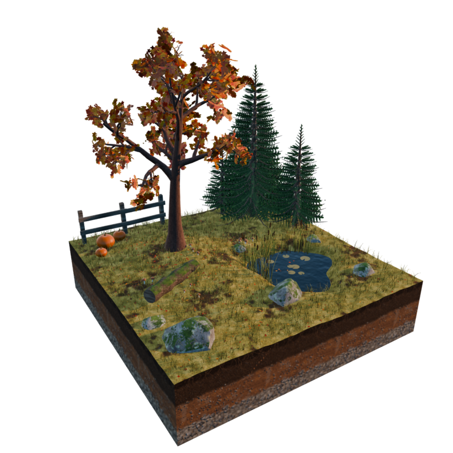

# 사계절 에셋 — 사실적 버전 (Realistic Four Seasons)

같은 장소(벚나무가 있는 언덕, 연못, 바위, 쓰러진 통나무, 나무 울타리, 가문비나무)를
봄·여름·가을·겨울 네 계절로 만든 7 m × 7 m 디오라마 타일 4개. Blender 5.2로 생성.

| 봄 Spring | 여름 Summer | 가을 Autumn | 겨울 Winter |
|---|---|---|---|
|  |  |  |  |
| 벚꽃 만개, 들꽃(데이지·민들레·제비꽃·미나리아재비), 떨어진 꽃잎 | 짙은 잎, 키 큰 풀, 부들, 연잎 | 붉은·주황 단풍, 마른 풀, 낙엽(연못 위 포함), 버섯, 호박 | 앙상한 가지 위 눈, 눈 덮인 가문비·바위·통나무·울타리, 얼어붙은 연못, 고드름 |

흙 단면과 바위 클로즈업:

## 파일

| 파일 | 내용 |
|---|---|
| `realistic_seasons.glb` | glTF 바이너리 (텍스처 포함) — Blender / Unity / Unreal / Godot / three.js 등에 바로 임포트 |
| `*_tile.png` | 계절별 렌더 (768×768, 투명 배경, 계절별 조명) |
| `spring_closeup.png` | 흙 단면·바위 클로즈업 |
| `realistic_seasons.py` | 씬을 처음부터 다시 만드는 생성 스크립트 (.blend가 필요하면 이걸 Blender에서 실행) |

## 흙과 돌

- **흙 단면(타일 옆면)**: 실제 토양 단면처럼 위에서부터
  유기층(검은 부엽토 + 뿌리·잔뿌리) → 표토(어두운 갈색, 작은 자갈) →
  점토층(적갈색, 산화철 얼룩, 회색 반점, 자갈) → 풍화암층(쪼개진 암편 사이로 흙이 찬 기반암).
  층 경계는 물결치듯 불규칙하고, 돌마다 음영과 접지 그림자, 노멀맵 요철이 있다.
- **바위**: 매끈한 덩어리가 아니라 여러 방향으로 쪼개진 면이 있는 화강암 바위.
  텍스처는 광물 입자(석영·장석·흑운모), 빗물 자국, 자연스럽게 휘어진 균열, 회녹색·주황 지의류.
  봄~가을에는 윗면에 이끼가 군데군데(바위 텍스처 위에 덧씌운 형태) 끼고, 겨울에는 눈이 쌓인다.
- 땅 위 흙 부분도 흙덩이 질감과 음영 있는 잔자갈로 바뀌었다.

## 구조

- 컬렉션 `Spring` / `Summer` / `Autumn` / `Winter`, 각 타일의 루트는 `<계절>_Tile` Empty.
  타일 안의 모든 오브젝트가 이 Empty의 자식이라 Empty만 옮기면 타일 전체가 따라온다.
- 오브젝트 이름이 역할을 그대로 말해준다: `Summer_CherryTree`, `Summer_CherryTree_Leaves`,
  `Winter_Spruce_1`, `Autumn_FallenLeaves`, `Spring_Grass`, `Spring_Rock_3`, `Winter_Ice` …
- 텍스처는 전부 스크립트가 직접 합성한 이미지(노멀맵 포함)라 GLB로 내보내도 그대로 따라간다.
- 잎·꽃·솔잎은 알파 클립 카드, 잔디는 실제 블레이드 메시.
- 겨울 눈(나뭇가지·바위·통나무·울타리 윗면)과 봄~가을 이끼는 위를 향한 면에 재질을 배정한 것이라 GLB에서도 유지된다.
- 단위 미터. 지형 윗면 ≈ z 0, 흙 단면 바닥 z = −1.4. 네 타일 합계 약 31만 폴리곤.

## 다시 만들기

Blender 5.x의 Scripting 탭에서 `realistic_seasons.py`를 열고 Run Script.
**현재 씬의 내용물을 전부 지운 뒤** 네 타일과 하늘·태양·카메라를 새로 만든다.
계절별 조명은 `apply_light("Spring")` 같은 함수로 바꿀 수 있다.
